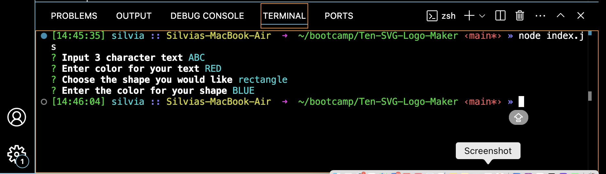

# Ten-SVG-Logo-Maker
To generate a logo using Node.js, command line and saving it as an SVG file 

## USER STORY 
As a freelance web developer 

I WANT to generate a simple logo for my projects 
SO THAT i dont have to pay a graphic designer.

## Installation 
- node.js V8 
- nmp i 
- npm Inquier
- Jest

## Usage 
--> After installation 
On the command line we all node index.js , Which you will prompted with 4 questions 
 
--> After user has prompt the answers , it will create svg log, Which will be locted inside folder called example/logo.svg 

## Demo
--> Click on the linkdemo below for a video demonstration 
[linkdemo](https://youtu.be/uqrWgjyIrj0)
